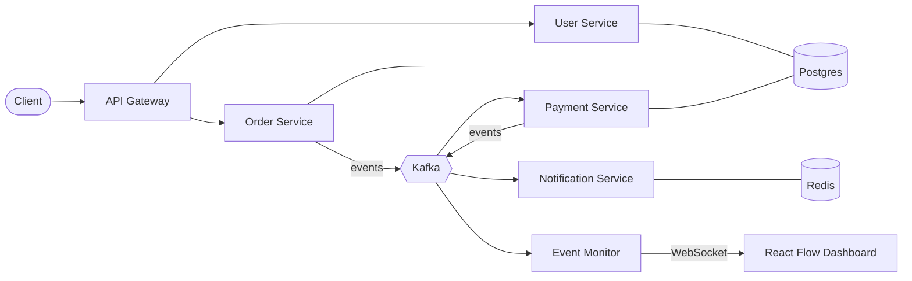

# Event Dashboard

A microservices system with a live dashboard that shows events moving between services as they happen.

The backend is a small e-commerce-style system (users, orders, payments, notifications). Its business logic is kept simple on purpose. What this project is really about is the **real-time architecture visualization**: a React Flow dashboard that draws every service as a node and animates each Kafka event along the edges, live, over WebSockets.

> **Status:** early development. The API Gateway and User Service are scaffolded. Everything else below is planned. See [Roadmap](#roadmap).

---

## Why this project exists

Most microservice demos stop at "here are some services that talk to each other." You can't *see* any of it happening. This project makes the event flow visible:

- Place an order and watch `order.created` travel from the Order Service to Kafka, then to the Payment Service.
- See the payment result fan out to the Notification Service.
- Spot slow or failing hops at a glance instead of digging through logs.

It's a portfolio piece that shows event-driven backend design and real-time frontend work in one system.

---

## Architecture



| Service | Role |
|---|---|
| **API Gateway** | Single entry point for clients. Routes requests to the services behind it. |
| **User Service** | User accounts and profiles (CRUD). |
| **Order Service** | Creates and tracks orders. Publishes order events. |
| **Payment Service** | Consumes order events, processes (simulated) payments, publishes the result. |
| **Notification Service** | Consumes events and sends notifications. Uses Redis. |
| **Event Monitor** | Subscribes to all Kafka topics and streams each event to the dashboard over WebSockets. |
| **Dashboard** | React Flow graph of the system that animates events between nodes in real time. |

### Example event chain

```
POST /orders
  → Order Service      publishes  order.created
  → Payment Service    consumes   order.created,  publishes payment.completed / payment.failed
  → Notification Svc   consumes   payment.*       sends the notification
  → Event Monitor      sees every hop, pushes it over WebSocket, and the dashboard animates the edge
```

*(Topic names are illustrative and may change as the services get built.)*

---

## Tech stack

| Layer | Tech |
|---|---|
| Services | NestJS (TypeScript) |
| Messaging | Apache Kafka |
| Database | PostgreSQL |
| Cache / pub-sub | Redis |
| Dashboard | React + React Flow |
| Real-time transport | WebSockets |
| Tooling | Vitest, oxlint, Prettier |
| Infra | Docker, Kubernetes |

---

## Repository layout

```
event-dashboard/
└── apps/
    ├── api-gateway/      # NestJS, scaffolded
    └── user-service/     # NestJS, scaffolded
    # planned: order-service, payment-service, notification-service,
    #          event-monitor, dashboard
```

Each service is its own NestJS app with its own `package.json`.

---

## Roadmap

- [ ] **1. Core services:** API Gateway, User, Order, and Payment services with basic CRUD *(Gateway and User scaffolded)*
- [ ] **2. Kafka event chain:** services communicate through events instead of direct calls
- [ ] **3. Redis + Notifications:** Notification Service driven by events
- [ ] **4. Dashboard:** React Flow graph of the architecture
- [ ] **5. Real-time animation:** Event Monitor streams events over WebSockets, and the dashboard animates them live
- [ ] **6. Dockerize:** every service containerized, one-command local stack with Docker Compose
- [ ] **7. Kubernetes:** deploy the full system to a cluster

---

## Running locally

Both services run from the repo root. It's an npm workspace, so one install covers all of them:

```bash
npm install
npm run dev
```

`npm run dev` starts the API Gateway and User Service together via `concurrently`, prefixing each log line with `[gateway]` or `[users]`. Both run under `nest start --watch`, so saving a file recompiles and restarts that service. `Ctrl+C` stops both.

| Service | URL |
|---|---|
| API Gateway | http://localhost:3000 |
| User Service | http://localhost:3001 |

To run a single service instead:

```bash
npm run start:dev -w user-service
```

Once Kafka, Postgres and Redis are added, they'll come up alongside this with `docker compose up`.

---

## Design choices

- **Simple business logic on purpose.** The CRUD is deliberately basic so the effort goes into the event flow and the visualization.
- **Events over direct calls.** Services communicate through Kafka, so each one can be developed, scaled and failed independently. This is also what makes the flow possible to visualize.
- **A dedicated Event Monitor.** Observability lives in its own service instead of being bolted onto each one. It listens to all topics and is the only thing the dashboard talks to.
